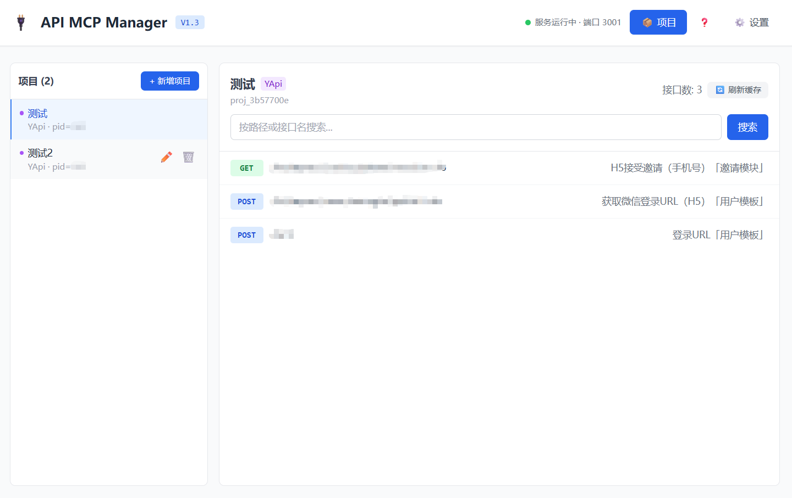
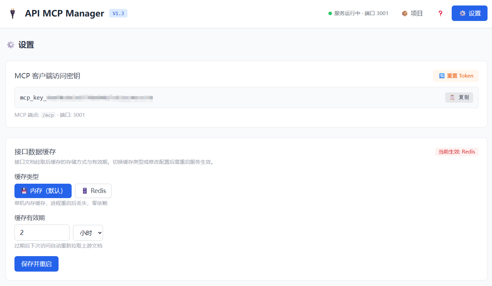

# 🔌 API MCP Manager

> 可视化 API 知识库 MCP 客户端 — 为 AI Agent（Cursor / Claude Desktop 等）提供统一的多项目 API 文档检索网关。

基于 MCP（Model Context Protocol）协议的 **Streamable HTTP** 传输，支持 Swagger/OpenAPI 和 YApi 双数据源、懒加载二级缓存、局部 `$ref` 解引用、双向鉴权加固。提供 Electron 桌面端 + Linux CLI Node SEA 单二进制 + Web 管理后台三种交付形态。

## ✨ 核心特性

- **Streamable HTTP 传输**：采用 MCP 官方新标准（单端点 `POST /mcp`），同时保留 `GET /mcp` SSE 端点以兼容旧客户端
- **四个只读工具**：`list_projects` / `get_api_list` / `get_api_details` / `get_project_detail`，严格只读边界
- **Swagger + YApi 双数据源**：支持标准 OpenAPI/Swagger（2.x/3.x）文档，也支持直接通过 YApi 开放 API 拉取接口数据
- **懒加载二级缓存**：首次调用时才拉取上游文档，TTL 默认 2h + 自动 GC，避免启动卡顿与内存暴涨；支持 Memory（单机）和 Redis（跨进程共享）两种缓存后端
- **局部 `$ref` 解引用**：仅展开目标接口节点的 schema，防循环引用，控制 token 成本
- **Web 管理后台**：React + Tailwind 可视化管理，支持项目 CRUD、接口搜索预览（Markdown 语法高亮）、连接测试、缓存刷新、安全设置
- **双向鉴权加固**：
  - MCP 客户端：静态 API Key（Bearer Header / X-MCP-Token / Query 降级）+ OAuth 2.1 预留骨架
  - 管理后台：动态 Session Token，仅回环地址允许 query 下发，CORS 运行时自适应
- **安全存储**：配置文件 `0600` 权限，上游 token 可选 AES-256-GCM 加密，日志自动脱敏
- **多形态交付**：Electron 桌面端（Win/Mac，托盘常驻 / 开机自启）+ Linux CLI（Node SEA 单二进制，无需 Node.js 运行时）

## 🏗️ 架构

```
api-mcp-manage/
├─ packages/
│  ├─ core/        # MCP 核心引擎：Express 服务器、MCP 工具注册、Swagger/YApi 拉取与解析、鉴权、配置管理、缓存
│  ├─ web/         # React 18 + Vite 5 + Tailwind CSS 3 管理后台 SPA
│  └─ desktop/     # Electron 壳（托盘常驻 / 开机自启 / 窗口管理）
└─ apps/
   └─ cli/         # Linux 无界面 CLI 入口（Node SEA 单二进制打包）
```

### 架构全景

```
                  MCP Client (Cursor / Claude Desktop)
                           │
                     POST /mcp  (Bearer token)
                     GET  /mcp  (SSE 兼容)
                           │
                  StaticKeyAuthProvider
                           │
                  ┌────────┴────────┐
                  │   MCP Server    │  ← @modelcontextprotocol/sdk
                  │   (请求级实例)   │     stateless 模式
                  │                 │
                  │ list_projects   │── config (热更新)
                  │ get_api_list    │── swagger/cache (懒加载)
                  │ get_api_details │── swagger/dereference (局部 $ref)
                  │ get_project_detail│── swagger/yapi (YApi 原生拉取)
                  └────────┬────────┘
                           │
              ┌────────────┼────────────┐
              │            │            │
         MemoryStore   RedisStore   normalize.ts
          (单机内存)    (跨进程)     (Swagger 2→3)
                           │
              ┌────────────┼────────────┐
              │            │            │
        format.ts   dereference.ts   yapi.ts
       (Markdown)   (局部展开)     (YApi→OpenAPI)

        Admin API (/admin/api/*)      Web Dashboard (/admin)
        │-- projects CRUD             │-- 项目管理（增删改查）
        │-- security / cache          │-- 接口搜索与预览（Markdown 高亮）
        │-- test / refresh / apis     │-- 连接测试 / 缓存刷新
                                      │-- 安全设置 / Token 管理
                                      │-- 缓存配置（Memory/Redis）
```

## 🚀 快速开始

### 环境要求
- Node.js ≥ 20
- pnpm ≥ 9

### 安装与运行

```bash
# 安装依赖
pnpm install

# 构建所有包（core + web + cli，不含 desktop）
pnpm build

# 启动 CLI 服务（需要先完成 build，tsx 可直接跑源码无需 build）
pnpm start
```

> **开发提示**：`pnpm start` 使用 tsx 直接运行 TypeScript 源码（无需预编译）。但 Web 管理后台需要先 `pnpm build` 或单独 `pnpm --filter @api-mcp/web build` 才能访问。

启动后控制台输出：

```
🚀 API MCP Manager Server (V1.3) 已启动！
─────────────────────────────────────────────────────
📡 MCP Endpoint (Streamable HTTP):  http://localhost:3001/mcp
🛠️  Web Dashboard:                   http://localhost:3001/admin?token=Session_xxx
🔑 MCP Client Token:                 mcp_key_xxx
─────────────────────────────────────────────────────
```

### 开发模式

```bash
# 终端 1：启动 core server（watch）
pnpm --filter @api-mcp/core dev

# 终端 2：启动 web 开发服务器（热更新，代理到 core）
pnpm --filter @api-mcp/web dev
```

## 🔗 客户端接入

在 Cursor 或 Claude Desktop 的 MCP 配置中添加：

**Cursor（Header 鉴权，推荐）**
```json
"mcpServers": {
  "api-mcp-manager": {
    "url": "http://localhost:3001/mcp",
    "headers": { "Authorization": "Bearer mcp_key_xxx" }
  }
}
```

**Claude Desktop（Query 传参，需注意日志泄露）**
```json
"mcpServers": {
  "api-mcp-manager": {
    "url": "http://localhost:3001/mcp?token=mcp_key_xxx"
  }
}
```

Token 可在 Web 后台的「安全」面板查看与重置。

## 🛠️ MCP 工具

| 工具 | 入参 | 返回 | 说明 |
|------|------|------|------|
| `list_projects` | — | JSON | 所有 API 项目列表（id、名称、描述） |
| `get_api_list` | `projectId`, `keyword?` | Markdown | 接口路由概要（首次触发懒加载，支持关键词过滤） |
| `get_api_details` | `projectId`, `path`, `method` | Markdown | 接口详情（参数表 + 请求体/响应 schema，局部 `$ref` 解引用） |
| `get_project_detail` | `projectId` | Markdown | 项目环境配置详情（仅 YApi 源项目，展示域名、Header 等） |

> 所有工具均标记 `readOnlyHint: true`，严格只读，不执行或修改任何资源。

## 🔐 安全设计

| 防护层 | 机制 |
|--------|------|
| MCP 端点鉴权 | 静态 API Key，三传参方式（Bearer / X-MCP-Token / Query 降级），401 拦截未授权 |
| MCP SSE 兼容 | `GET /mcp` 端点同样走鉴权，支持旧版客户端 |
| 管理后台鉴权 | 一次性 Session Token，URL 传入后立即清除；仅回环地址允许 query 下发，非回环拒绝 |
| 配置存储 | 文件 `0600` 权限，上游 token AES-256-GCM 加密（密钥来自环境变量或机器绑定派生） |
| 日志脱敏 | URL 中 `token=xxx` 自动脱敏为 `***`；元数据中 token/authorization 字段同样脱敏 |
| TLS 警告 | 启动时检测非回环绑定，输出强警告提示需反向代理 TLS 终接；可通过 `MCP_SKIP_TLS_WARNING=1` 抑制 |

## 📦 数据源支持

### OpenAPI / Swagger

支持 Swagger 2.x 和 OpenAPI 3.x 文档。Swagger 2.0 文档在拉取阶段自动归一化为 OpenAPI 3.x 结构（body/formData 参数 → requestBody，response.schema → content），下游统一处理一套格式。

### YApi（原生支持）

直接通过 YApi 开放 API 拉取接口数据（非 swagger 导出方式），支持：

- 按菜单分组展示接口列表（`catname`）
- 并发受限拉取详情（5 并发）
- 环境配置查询（`get_project_detail` 返回域名、Header 等）
- 自动转换：req_query/req_headers/req_params → OpenAPI 参数；req_body_form/req_body_other → requestBody；res_body → 响应 schema

## 🖥️ Web 管理后台

内置 React 18 + Tailwind CSS 3 管理后台，功能包括：

| 功能模块 | 说明 |
|----------|------|
| 项目管理 | 增删改查，支持 Swagger 和 YApi 两种来源切换，Token 加密输入 |
| 接口浏览 | 按项目查看接口列表（方法颜色标签），关键词搜索，点击查看 Markdown 详情（代码语法高亮 + XSS 防护） |
| 连接测试 | 验证上游文档源可访问性，返回文档 title / 接口数 / 版本 |
| 缓存刷新 | 强制从上游重新拉取文档，立即生效 |
| 安全设置 | MCP 客户端 Token 查看 / 复制 / 重置，一键使旧 Token 失效 |
| 缓存配置 | Memory / Redis 切换，TTL 设置，Redis 连接测试后保存，服务自动重启 |
| MCP 接入指南 | 内建帮助弹窗，提供 Cursor / Claude Desktop 的配置 JSON（一键复制） |

### 界面截图





## 🧪 测试

```bash
# 运行全部测试（11 个测试文件，覆盖 config / auth / format / $ref 解引用 / 归一化 / 缓存 / 缓存存储 / YApi / 工具 / 服务器 / 集成）
pnpm --filter @api-mcp/core test

# 类型检查（4 包）
pnpm -r run typecheck
```

### 测试覆盖

| 测试文件 | 覆盖范围 |
|----------|----------|
| `config` | 默认配置创建、0600 权限、AES-256-GCM 加解密、CRUD、Token 重置、缓存设置、ID 生成器 |
| `auth` | Bearer/X-MCP-Token/Query 传参、401 拒绝、Admin token、回环/非回环 query 策略 |
| `format` | 列表/关键词过滤/空路径、详情参数表+响应 JSON、废弃标记、NotFound 提示 |
| `dereference` | OpenAPI 3.x / Swagger 2.x `$ref`、嵌套递归、循环引用、同级属性合并、未命中保留 |
| `normalize` | Swagger 2.0 body→requestBody、response.schema→content、formData 合并、深拷贝 |
| `cache` | 并发去重、TTL 过期、invalidate、GC、reinitCache 切换、失败可重试 |
| `cache-store` | Memory/Redis Store 接口契约、JSON 往返、TTL 传递、错误降级、Redis URL 解析 |
| `yapi` | query/header/path/form/json/raw body 转换、res_body 智能判定、HTML 清理、菜单名拼接 |
| `tools` | parameter/requestBody/response 中 `$ref` 解引用、paramType 可读性 |
| `server` | MCP 鉴权、initialize/tools/list/list_projects 协议、Admin CRUD + 热更新、Token 重置 |
| `integration` | 公网 Petstore v2/v3 完整管线（拉取→归一化→列表→详情→解引用→格式化） |

## 🛠️ 技术栈

| 层 | 技术 |
|----|------|
| 运行时 | Node.js ≥ 20 |
| 语言 | TypeScript 5.6（strict 模式） |
| 包管理 | pnpm 9（monorepo workspace） |
| MCP 协议 | `@modelcontextprotocol/sdk` ^1.29（Streamable HTTP + SSE） |
| HTTP 服务器 | Express 4（单端口 MCP + Admin + 静态文件） |
| 前端框架 | React 18 + Vite 5 + Tailwind CSS 3 |
| Markdown 渲染 | marked 18 + highlight.js 11 + DOMPurify（XSS 防护） |
| 日志 | Winston（结构化日志 + 敏感信息脱敏） |
| 校验 | Zod（MCP 工具入参） |
| 缓存 | 内存 Map（单机）/ ioredis（跨进程） |
| 桌面端 | Electron 33 + electron-builder 25 |
| 单二进制 | Node.js SEA + esbuild + postject |
| 测试 | Vitest（11 个测试文件） |

## 📦 打包

### 完整流程（一次性产出全部形态）

```bash
pnpm install                            # 安装依赖
pnpm build                              # core + web + cli（不含 desktop）
pnpm --filter @api-mcp/cli build:sea    # Linux/无界面单二进制
pnpm --filter @api-mcp/desktop build    # desktop 主进程打包（esbuild → CJS）
pnpm --filter @api-mcp/desktop dist     # Electron 安装包（DMG / NSIS）
```

### 逐项说明

| 目标 | 命令 | 产物 | 说明 |
|------|------|------|------|
| Core 引擎 | `pnpm --filter @api-mcp/core build` | `packages/core/dist/` | TypeScript 编译 |
| Web 管理后台 | `pnpm --filter @api-mcp/web build` | `packages/web/dist/` | Vite 构建，运行时由 core 托管 |
| 一键构建（core+web+cli） | `pnpm build` | — | 等价于 `pnpm -r --filter=!@api-mcp/desktop run build`，日常本地运行用此 + `pnpm start` |
| **Linux 单二进制** | `pnpm --filter @api-mcp/cli build:sea` | `apps/cli/sea-out/api-mcp-<platform>-<arch>`（约 174M） | Node SEA，脚本内置验证（启动 + MCP 响应） |
| **Electron 桌面端** | `pnpm --filter @api-mcp/desktop build && pnpm --filter @api-mcp/desktop dist` | `packages/desktop/release/API MCP Manager-1.3.0.dmg`（约 102M）/ `.exe` | macOS DMG / Windows NSIS |

> ⚠️ **Electron 两步构建**：desktop 的 `build`（esbuild 把主进程 + `@api-mcp/core` 打成单一 CJS，规避 ESM/CJS 互操作）与 `dist`（electron-builder）是两个独立步骤，**不能跳过 `build` 直接 `dist`**，否则 asar 内缺少入口文件。

### SEA 单二进制运行

```bash
# 产物路径含平台与架构后缀，如 darwin-x64 / linux-x64
./apps/cli/sea-out/api-mcp-darwin-x64

# 可选：把 web 构建产物放到二进制同目录，启用管理后台 UI
mkdir -p apps/cli/sea-out/assets/web
cp -r packages/web/dist/* apps/cli/sea-out/assets/web/
```

**SEA 部署形态**：把生成的二进制 + `assets/web/`（可选）放到目标机器即可，无需 Node.js 运行时。

### 辅助命令

| 命令 | 用途 |
|------|------|
| `pnpm test` | 全部测试（11 文件） |
| `pnpm -r run typecheck` | 4 包类型检查 |
| `pnpm start` | 本地运行 CLI 服务（tsx 直接跑源码） |
| `pnpm --filter @api-mcp/web dev` | Web 开发热更新（代理到 core:3001） |
| `pnpm --filter @api-mcp/core dev` | Core watch 模式 |
| `pnpm --filter @api-mcp/desktop pack` | Electron 仅打目录包（不生成安装包，调试用） |

## 🧪 验证状态

| 验证项 | 状态 |
|--------|------|
| 单元 + 集成测试（11 文件：config / auth / format / $ref / 归一化 / 缓存 / 缓存存储 / YApi / 工具 / 服务器 / 集成） | ✅ 全部通过 |
| MCP 协议端到端（initialize / tools/list / tools/call，含鉴权） | ✅ 通过 |
| $ref 解引用（真实 Petstore API，含 Swagger 2.x body 参数 + 循环引用防护） | ✅ 通过 |
| YApi 原生拉取与转换（菜单分组 / 并发详情拉取 / OpenAPI 转换） | ✅ 通过 |
| 热更新（Admin CRUD 后 list_projects 立即反映变化） | ✅ 通过 |
| 生产集成（web 托管 + CRUD + 接口搜索 + Markdown 渲染 + XSS 防护） | ✅ 通过 |
| Node SEA 单二进制（独立运行 + MCP 响应 + 管理 API） | ✅ 通过 |
| Electron 桌面端（DMG 打包 + 托盘菜单 + 启动 MCP server + tools/list） | ✅ 通过 |
| 缓存双模切换（Memory ↔ Redis，reinitCache 平滑迁移） | ✅ 通过 |

## 📋 配置与数据流

### 配置文件

存储路径：
- macOS/Windows (Electron)：`app.getPath('userData')/mcp-projects.json`（如 `%APPDATA%/api-mcp-manager/`）
- Linux (CLI)：`~/.config/api-mcp-manager/mcp-projects.json`（或 `$XDG_CONFIG_HOME`）
- SEA 单二进制：二进制同目录 `config/mcp-projects.json`

### 数据流

```
用户添加项目 (Web Admin)
  → POST /admin/api/projects
  → config/index.ts 持久化（加密 token → 0600 文件）
  → MCP 工具动态读取最新配置（热更新，无需重启）

AI 调用 get_api_list (MCP Client)
  → tools/index.ts 读取项目配置
  → swagger/cache.ts getProjectDoc()
     ├── 缓存命中且未过期 → 直接返回
     ├── 缓存未命中 → fetchAndParse()
     │   ├── source=swagger → fetchJson(url) → normalizeDocument()
     │   └── source=yapi    → fetchYapiDocument() (并发5, 拉取菜单+详情)
     └── 并发去重（同项目重复请求共享同一 Promise）
  → swagger/dereference.ts（局部 $ref 展开）
  → swagger/format.ts（Markdown 格式化）
  → 返回给 LLM
```

## 📄 许可证

MIT

## 🌐 环境变量

| 变量 | 用途 | 默认值 |
|------|------|--------|
| `MCP_PORT` | CLI/SEA 服务器端口 | `3001`（core 内部自动探测 3001-3100） |
| `MCP_CONFIG_PATH` | 配置文件自定义路径 | 平台默认路径 |
| `MCP_CONFIG_KEY` | Token 加密密钥（AES-256-GCM） | 机器绑定派生 |
| `MCP_CONFIG_DISABLE_ENCRYPT` | 设为 `"1"` 禁用 Token 加密 | — |
| `MCP_LOG_LEVEL` | 日志级别（debug/info/warn/error） | `info` |
| `MCP_SKIP_WEB` | 设为 `"1"` 不托管 Web 管理后台 | — |
| `MCP_SKIP_TLS_WARNING` | 设为 `"1"` 抑制非回环 TLS 警告 | — |
